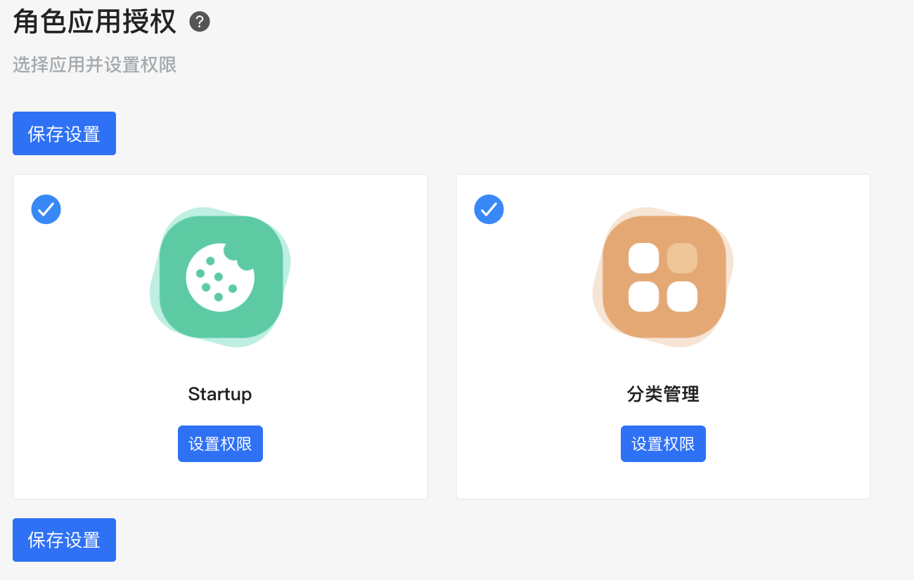

# 角色

内置角色管理。

### 角色

系统内的用户角色，主要属性包括 ```角色级别```、```角色名称```、```角色权限``` 三个部分构成。

**角色级别**

|  角色   | 说明  | 备注  |
|  ----  | ----  | ----  |
| general（普通管理员）  | 不能访问任何系统功能，只能根据给予的扩展应用权限，访问具体的应用 | 通过 /admin 登录 |
| operation（运营管理员）  | 可以设置系统权限，具有访问所有扩展应用的权限 | 通过 /admin 登录 |
| extension（应用管理员）  | 不能访问任何系统能，只能根据给予的扩展应用权限，访问应用。和general区别是具有单独的的登录入口 | 通过 应用中心 登录 |
| superadmin（超级管理员）  | 超级管理员 |  |

### 角色和权限

请参照下图

添加角色


设置应用权限


设置应用权限
