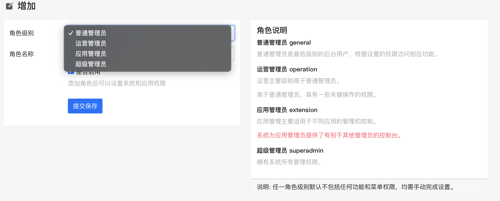
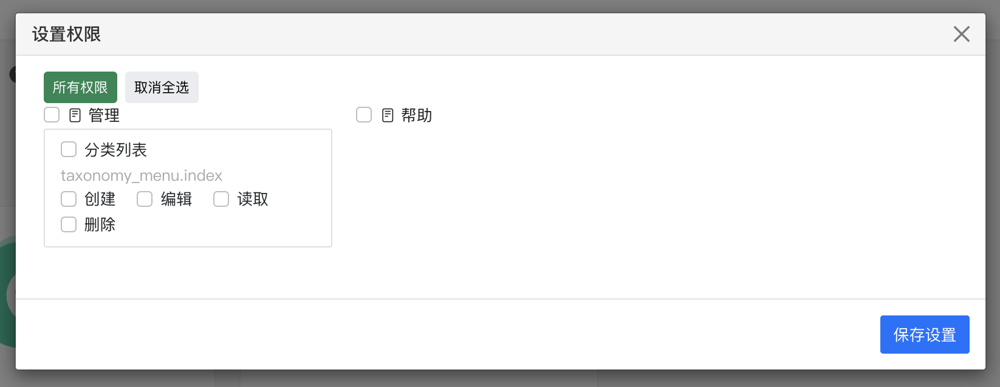

# Role

Role and permission

### Roles

Attributes include ```role level```、```role name```、```role permission``` 

**Levels**

|  Level   | Description  | Remark  |
|  ----  | ----  | ----  |
| general  | Can't access any system functions, can only access specific extensions |  /admin  |
| operation  | System permissions allowed, with access to all extensions | /admin  |
| extension  | Can't access any system functions, can only access specific extensions | /appcenter |
| superadmin  | SuperAdmin |  |

### Permission


Add Role


Set permission


Set extension permission
